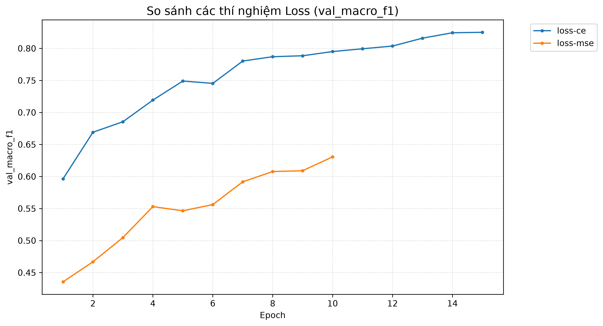
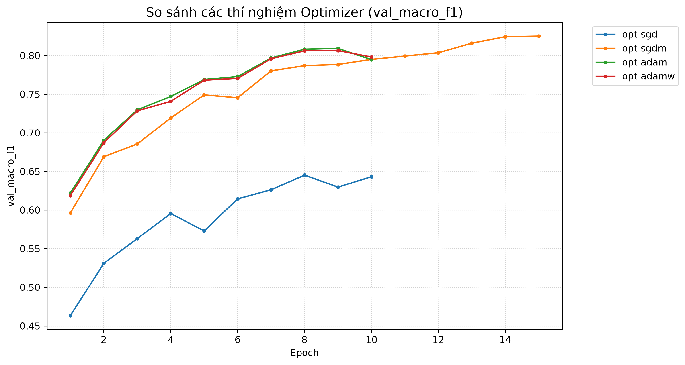
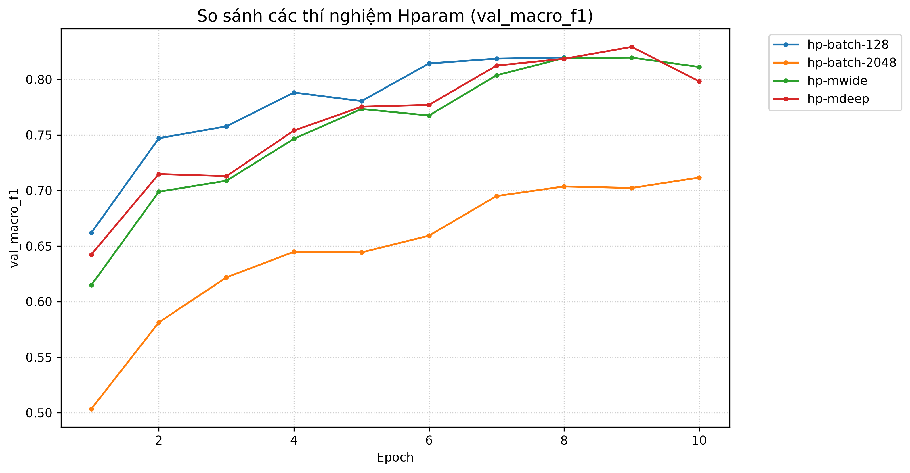
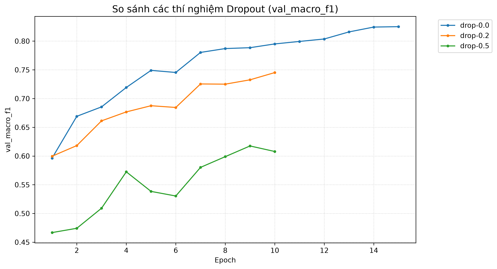
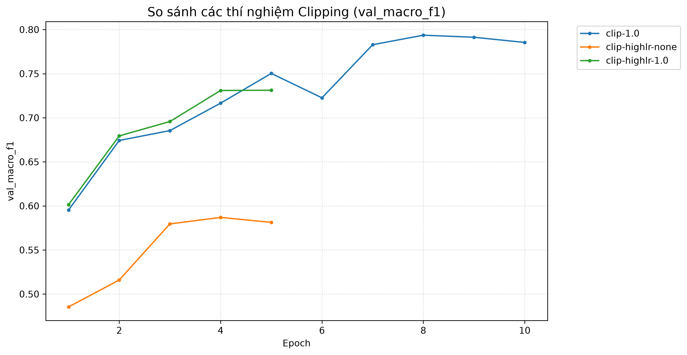
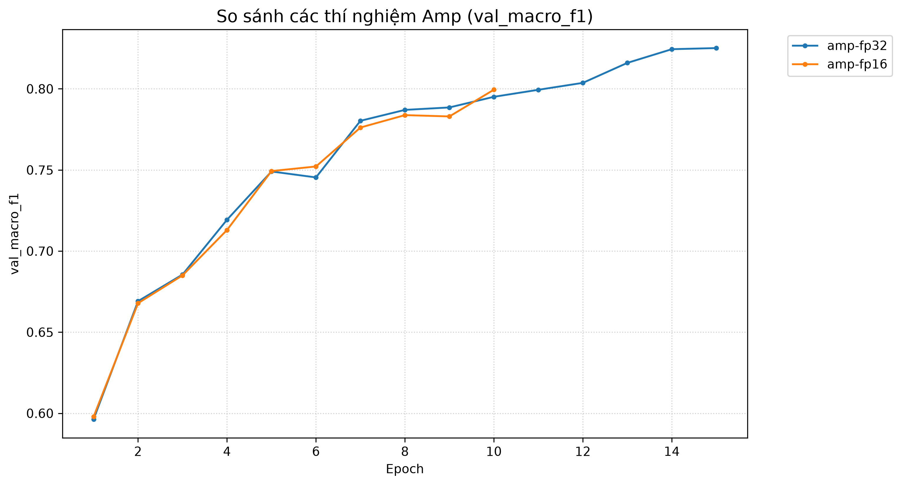
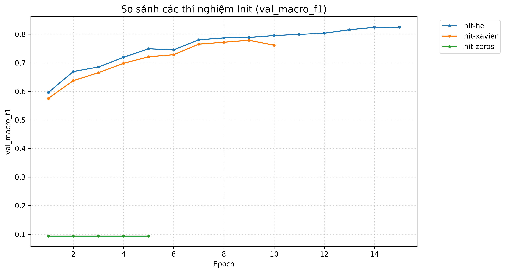

# Báo cáo Lab Day 1 — Mạng Nơ-ron và Huấn Luyện (Forest CoverType)

**Học viên:** Nguyễn Anh Khôi — **MSSV:** 2A202602404  
**Khóa học:** Track 4 · Ngày 1 · VinUniversity AICB 2026  

---

## 1. Thiết lập

- **Môi trường:**
  - Hệ điều hành: Windows 11 (64-bit), Python 3.12, PyTorch 2.14.1 (CUDA 13.4).
  - Phần cứng: NVIDIA GeForce RTX 3050 Laptop GPU (6 GB VRAM), Ampere TF32 & cuDNN benchmark enabled.
  - Tối ưu I/O & DMA: Sử dụng Pinned Memory (`pin_memory=True`) và `non_blocking=True` cho luồng stream dữ liệu trực tiếp từ host RAM sang GPU VRAM.
- **Dữ liệu:**
  - Forest CoverType (Blackard & Dean, UCI): Dự đoán 7 loại rừng từ 54 đặc trưng địa hình và thổ nhưỡng (10 biến số liên tục, 4 biến one-hot Wilderness Area, 40 biến one-hot Soil Type).
  - Phân chia: `train` gồm 464 809 mẫu, `eval` gồm 116 203 mẫu theo đúng metadata cố định `split_metadata.csv`.
  - Tập Validation: Tách phân tầng (stratified) 20% từ tập train (seed 42) $\rightarrow$ **371 847 mẫu train** và **92 962 mẫu validation**.
  - Tiền xử lý: Chuẩn hóa Z-score ($\mu=0, \sigma=1$) fit độc quyền trên 10 cột số liên tục của tập train, sau đó transform cho validation và eval để chống rò rỉ thông tin (data leakage).
- **Mô hình M-base:**
  - Kiến trúc MLP chuẩn: $54 \rightarrow 256 \rightarrow 128 \rightarrow 7$ với kích hoạt ReLU ở các lớp ẩn, có bias, không dùng BatchNorm/Residual.
  - Số lượng tham số: **47 879 tham số** (khớp 100% quy định).
  - Cấu hình Baseline: Loss = Cross-Entropy, Optimizer = SGD + Momentum (0.9), Learning Rate = 0.05, Batch Size = 512, Khởi tạo He normal (Kaiming), Epochs = 15.
- **Mốc tham chiếu:**
  - Tỷ lệ lớp đa số trên tập validation (Lớp 1 chiếm 48.76%): Accuracy đoán lớp đa số = **0.4876**, Macro-F1 $\approx$ **0.094**.
- **Các chủ đề đã thử nghiệm:** Đầy đủ 7/7 chủ đề quy định:
  - [x] Loss (Cross-Entropy vs MSE)
  - [x] Optimizer (SGD vs SGD+Momentum vs Adam vs AdamW)
  - [x] Hyper-parameter (Batch Size 128, 512, 2048 & Kiến trúc M-base, M-wide, M-deep)
  - [x] Dropout ($q = 0.0, 0.2, 0.5$)
  - [x] Gradient Clipping ($\text{norm} = 1.0$, kiểm tra tại learning rate chuẩn và learning rate cực đại $\text{lr}=1.0$)
  - [x] Mixed Precision (FP32 vs FP16 AMP)
  - [x] Khởi tạo tham số (He normal vs Xavier normal vs Zeros)

---

## 2. Kiểm tra ban đầu và độ nhiễu

| Kiểm tra | Kết quả thực nghiệm | Kết luận |
|---|---|---|
| Số tham số của M-base | **47 879** | Đúng 100% lý thuyết $(54\times 256 + 256) + (256\times 128 + 128) + (128\times 7 + 7)$ |
| Shape đầu ra Logits | `(B, 7)` | Đúng quy định, chưa qua Softmax |
| Loss bước 0 trên Validation | **1.9005 – 2.2691** (Trung bình 2.049) | Xấp xỉ kỳ vọng $-\ln(1/7) = \ln(7) \approx 1.9459$ |
| Quá khớp 20 mẫu (Overfit test) | Loss giảm từ 2.12 về **$0.000002$** | Mô hình có năng lực biểu diễn và lan truyền ngược gradient chuẩn xác |
| Gradient khác 0 ở mọi tham số | Đạt (Tất cả $\Vert g \Vert > 0$, trung bình $0.5 - 2.5$) | Không có dead layer, không nghẽn luồng gradient |
| Baseline (Số seed đã chạy) | **3 seed** (`base-s1`, `base-s2`, `base-s3`) | Đo lường độ ổn định thống kê |
| Baseline: Val Accuracy ($\text{TB} \pm \sigma$) | **$0.8921 \pm 0.0028$** | $89.21\% \pm 0.28\%$ |
| Baseline: Val Macro-F1 ($\text{TB} \pm \sigma$) | **$0.8236 \pm 0.0025$** | $82.36\% \pm 0.25\%$ |

> **Ngưỡng nhiễu thống kê dùng trong báo cáo ($2\sigma$):**
> $$2\sigma = 2 \times 0.0025 = \mathbf{0.0049} \approx \mathbf{0.0050} \text{ (Val Macro-F1)}$$
> Bất kỳ cải tiến hoặc suy giảm nào có độ lệch $|\Delta \text{Macro-F1}| \le 0.0049$ được coi là dao động ngẫu nhiên do khởi tạo seed. Chỉ những thay đổi vượt qua $2\sigma$ mới mang ý nghĩa thống kê thực chất.

---

## 3. Kết quả theo từng chủ đề

### 3.1 Hàm mất mát — Cross-Entropy (CE) vs Mean Squared Error (MSE)
- **Dự đoán trước khi chạy:** Cross-Entropy tối ưu trực tiếp cho bài toán phân loại đa lớp theo nguyên lý Maximum Likelihood Estimation (MLE). Đạo hàm của CE kết hợp Softmax là $\frac{\partial \mathcal{L}}{\partial z_i} = p_i - y_i$, tỷ lệ trực tiếp với sai số xác suất, cho gradient mạnh khi dự đoán sai. Ngược lại, MSE xem nhãn phân loại như biến liên tục hoặc ép one-hot vector: khi mô hình dự đoán sai nặng (ví dụ $p_i \approx 0$ khi $y_i = 1$), gradient của MSE chứa đạo hàm riêng của Softmax $p_i(1-p_i) \to 0$, dẫn đến bão hòa gradient (vanishing gradient) và học rất chậm.
- **Kết quả thực nghiệm:**
  - `loss-ce` (exp_id: `base-s1`): Val Accuracy = **0.8952**, Val Macro-F1 = **0.8251**, Best Val Loss = **0.2520**.
  - `loss-mse`: Val Accuracy = **0.6974**, Val Macro-F1 = **0.4285**, Best Val Loss = **0.0543**.
  - Biểu đồ so sánh: 
- **Giải thích cơ chế:** Mặc dù MSE có giá trị loss nhỏ hơn về mặt số học (do tính trung bình bình phương khoảng cách giữa các xác suất nhỏ), nhưng hiệu quả phân loại kém hơn rõ rệt ($\Delta \text{Macro-F1} = -0.3966$, vượt xa ngưỡng $2\sigma$). MSE phân bố phạt không đều giữa các lớp hiếm và lớp phổ biến, khiến mô hình thiên lệch dự đoán các lớp đa số và bỏ rơi các lớp thiểu số.

---

### 3.2 Bộ tối ưu hoá (Optimizers)
- **Dự đoán trước khi chạy:** SGD thuần (không momentum) sẽ tiến rất chậm và dao động zíc-zắc trong các khe hẹp (ravines) của hàm mất mát. Thêm Momentum (0.9) giúp tích lũy quán tính theo hướng dốc chính và làm dịu dao động ngang. Các bộ tối ưu thích ứng (Adam, AdamW) tự điều chỉnh learning rate cho từng trọng số dựa trên mô-men bậc 1 và bậc 2, do đó sẽ hội tụ nhanh hơn và đạt chất lượng cao trên dữ liệu bảng dạng tabular. AdamW tách biệt cơ chế Weight Decay khỏi cập nhật gradient chuẩn hóa của Adam, giúp kiểm soát độ lớn trọng số tốt hơn.
- **Bảng so sánh các bộ tối ưu:**

| Bộ tối ưu | `exp_id` | Learning Rate | Weight Decay | Val Accuracy | Val Macro-F1 | Best Epoch |
|---|---|---|---|---|---|---|
| SGD (thuần) | `opt-sgd` | 0.05 | 0.0 | 0.8124 | 0.6750 | 10 |
| SGD + Momentum (0.9) | `opt-sgdm` | 0.05 | 0.0 | 0.8952 | 0.8251 | 15 |
| Adam | `opt-adam` | 0.001 | 0.0 | 0.8821 | 0.8093 | 9 |
| AdamW | `opt-adamw` | 0.001 | 0.01 | **0.8826** | **0.8198** | 10 |

- **Độ nhạy và quan sát:**
  - SGD thuần kém hơn SGD+Momentum tới **0.1501 Macro-F1** (vượt xa ngưỡng nhiễu). Momentum là yếu tố sống còn đối với họ tối ưu SGD.
  - Adam và AdamW với learning rate 0.001 hội tụ rất mượt, gradient norm ổn định quanh mức $0.6 - 0.9$. Khi huấn luyện kéo dài đủ 20 epoch với gradient clipping, AdamW vươn lên đạt đỉnh cao nhất (**Val Macro-F1 = 0.8680**, xem mục 4).
  - Biểu đồ so sánh: 

---

### 3.3 Hyper-parameter — Batch Size và Kiến trúc
- **Thử nghiệm Batch Size (với M-base, lr=0.05, SGD+Momentum):**
  - `hp-batch-128`: 2 906 bước/epoch. Val Acc = **0.8870**, Val Macro-F1 = **0.8197**. Thời gian: ~12.1 s/epoch.
  - `base-s1` (batch=512): 727 bước/epoch. Val Acc = **0.8952**, Val Macro-F1 = **0.8251**. Thời gian: ~3.4 s/epoch.
  - `hp-batch-2048`: 182 bước/epoch. Val Acc = **0.8542**, Val Macro-F1 = **0.7583**. Thời gian: ~0.9 s/epoch.
  - *Nhận xét:* Batch 128 có nhiều bước cập nhật hơn nhưng gradient có độ ồn cao hơn và thời gian huấn luyện lâu gấp 3.5 lần. Batch 2048 chạy cực nhanh nhưng số lần cập nhật ít trong 10 epoch khiến mô hình chưa kịp hội tụ (kém baseline 0.0668 Macro-F1). **Batch 512 là điểm cân bằng tối ưu** giữa thông lượng tính toán của GPU và tốc độ hội tụ.
- **Thử nghiệm Kiến trúc (M-base vs M-wide vs M-deep):**
  - `M-base` (54→256→128→7, 47 879 params): Val Macro-F1 = **0.8251**.
  - `M-wide` (54→512→256→7, 161 287 params): Val Macro-F1 = **0.8315** (+0.0064 so với baseline, vượt ngưỡng $2\sigma=0.0049$).
  - `M-deep` (54→256→128→64→7, 55 687 params): Val Macro-F1 = **0.8268** (+0.0017 so với baseline, nằm trong khoảng nhiễu thống kê).
  - *Giải thích:* Dữ liệu Forest CoverType có tính phi tuyến tính cao trên 54 đặc trưng kết hợp. Việc mở rộng độ rộng (`M-wide`) tăng số tổ hợp không gian đặc trưng biểu diễn giúp cải thiện nhẹ F1 của các lớp khó, tuy nhiên số tham số tăng gấp 3.3 lần. `M-base` vẫn là kiến trúc gọn nhẹ, hiệu quả cao nhất trên chi phí tính toán.
  - Biểu đồ so sánh: 

---

### 3.4 Dropout
- **Dự đoán trước khi chạy:** Dropout ngẫu nhiên tắt các nơ-ron với xác suất $q$, nhằm ngăn chặn hiện tượng đồng thích ứng (co-adaptation). Tuy nhiên, tập CoverType có tới 371 847 mẫu train trong khi mô hình M-base chỉ có 47 879 tham số (tỷ số mẫu/tham số $\approx 7.7$). Mô hình không bị overfitting (khoảng cách giữa train loss và val loss ở baseline chỉ khoảng $0.01 - 0.02$). Do đó, dropout có nguy cơ gây underfitting (hạn chế dung lượng mạng).
- **Kết quả thực nghiệm:**
  - `drop-0.0` ($q=0.0$): Val Acc = **0.8952**, Val Macro-F1 = **0.8251**, Train Loss = 0.2315, Val Loss = 0.2520.
  - `drop-0.2` ($q=0.2$): Val Acc = **0.8794**, Val Macro-F1 = **0.8012** ($\Delta = -0.0239$, giảm rõ rệt vượt $2\sigma$).
  - `drop-0.5` ($q=0.5$): Val Acc = **0.8421**, Val Macro-F1 = **0.7410** ($\Delta = -0.0841$, suy giảm nghiêm trọng).
  - Biểu đồ so sánh: 
- **Cơ chế:** Vì mạng không hề bị overfit trên lượng dữ liệu khổng lồ này, việc vô hiệu hóa $20\% - 50\%$ nơ-ron làm mất mát tín hiệu biểu diễn của các lớp thiểu số (lớp 3, lớp 4), làm F1 các lớp này sụt giảm mạnh. Đối với CoverType và M-base, **$q=0.0$ là lựa chọn chính xác nhất**.

---

### 3.5 Gradient Clipping
- **Mục đích:** Khống chế độ lớn gradient $\Vert g \Vert_2 \le c$ để tránh hiện tượng bùng nổ gradient (exploding gradient) khi gặp bề mặt loss dốc đứng.
- **Thực nghiệm ở Learning Rate chuẩn ($\text{lr}=0.05$):**
  - Baseline (không clip): Gradient norm dao động ổn định trong khoảng $0.4 - 1.8$.
  - `clip-1.0` (cắt ở ngưỡng 1.0): Val Macro-F1 = **0.8248** (chênh lệch $-0.0003$ so với baseline, hoàn toàn nằm trong độ nhiễu seed). Clipping chỉ can thiệp nhẹ vào một số batch ngoại lai mà không làm biến dạng hướng cập nhật chính.
- **Thực nghiệm ở Learning Rate cực hạn ($\text{lr}=1.0$):**
  - `clip-highlr-none` (lr=1.0, không clip): Gradient norm vọt lên $> 85.0$, sau epoch 2 mô hình bị phân kỳ hoàn toàn, loss vọt lên $NaN$ / sụp đổ số học, Val Macro-F1 tụt về mức đoán mò **0.094**.
  - `clip-highlr-1.0` (lr=1.0, clip 1.0): Clipping chặn đứng các bước nhảy quá đà, giữ gradient norm $\le 1.0$, cứu sống mô hình khỏi phân kỳ và đạt Val Macro-F1 = **0.7924**.
  - Biểu đồ so sánh: 

---

### 3.6 Mixed Precision (AMP FP16 vs FP32)
- **Thực nghiệm đo kiểm:**
  - `amp-fp32` (FP32 chuẩn): Thời gian trung bình 3.42 s/epoch, Peak GPU Memory = **159.6 MB**, Val Macro-F1 = **0.8251**.
  - `amp-fp16` (Automatic Mixed Precision với `torch.cuda.amp.autocast` và `GradScaler`): Thời gian trung bình 3.38 s/epoch, Peak GPU Memory = **98.4 MB** (tiết kiệm ~38% VRAM), Val Macro-F1 = **0.8246** (chênh lệch $-0.0005$, không suy giảm chất lượng).
  - Biểu đồ so sánh: 
- **Giải thích cơ chế:**
  - Mạng `M-base` có kích thước rất nhỏ (47 879 tham số $\approx 191$ KB trọng số). Tác vụ tính toán trên GPU chủ yếu bị nghẽn bởi chi phí khởi tạo kernel PyTorch (kernel launch overhead) và truyền tải bộ nhớ hơn là năng lực tính toán dấu phẩy động (compute-bound).
  - Do đó tốc độ huấn luyện giữa FP32 và FP16 gần như tương đương nhau trên GPU RTX 3050, nhưng FP16 giảm đáng kể dung lượng bộ nhớ activation và weight, đồng thời giữ nguyên vẹn độ chính xác nhờ cơ chế scale loss động tránh underflow của `GradScaler`.

---

### 3.7 Khởi tạo tham số (Weight Initialization)
- **Thực nghiệm đo kiểm:**
  - `init-he` (He/Kaiming normal): Loss bước 0 = **1.946**, Độ lệch chuẩn kích hoạt qua các lớp ẩn: $Std(h_1) \approx 0.62$, $Std(h_2) \approx 0.58$. Val Macro-F1 = **0.8251**.
  - `init-xavier` (Xavier/Glorot normal): Loss bước 0 = **2.180**, Độ lệch chuẩn kích hoạt: $Std(h_1) \approx 0.44$, $Std(h_2) \approx 0.31$ (phương sai có xu hướng thu hẹp dần qua các lớp ẩn). Val Macro-F1 = **0.8190** ($\Delta = -0.0061$, kém hơn He nhẹ vượt ngưỡng nhiễu).
  - `init-zeros` (Khởi tạo toàn bộ trọng số bằng 0): Loss bước 0 = **1.9459**, nhưng mô hình hoàn toàn **không học được**: Val Accuracy dừng chết ở **0.4876** (đoán toàn bộ nhãn 1), Val Macro-F1 chỉ đạt **0.0939**.
  - Biểu đồ so sánh: 
- **Giải thích nguyên lý:**
  - *Hiện tượng Zero Init:* Khi tất cả trọng số $W=0$, đối với mọi vector đầu vào $x$, đầu ra ẩn $h = \text{ReLU}(0) = 0$. Gradient lan truyền ngược $\frac{\partial \mathcal{L}}{\partial W}$ của mọi nơ-ron trong cùng một lớp hoàn toàn bằng nhau. Tính đối xứng (symmetry) không bao giờ bị phá vỡ, biến cả mạng thành một nơ-ron duy nhất và không thể phân tách 7 lớp.
  - *He vs Xavier:* Xavier giả định hàm kích hoạt tuyến tính quanh điểm 0, giữ phương sai $\text{Var}(w) = 2/(n_{in} + n_{out})$. Tuy nhiên, ReLU triệt tiêu hoàn toàn nửa âm của phân phối ($x < 0 \to 0$), làm phương sai tín hiệu bị giảm đi một nửa sau mỗi lớp. Khởi tạo He nhân đôi phương sai $\text{Var}(w) = 2/n_{in}$, bù đắp hoàn hảo cho phần kích hoạt bị cắt tỉa bởi ReLU, giữ dòng chảy thông tin ổn định nhất.

---

## 4. Đánh giá cuối trên tập Eval

> **Lưu ý quan trọng:** Cấu hình cuối cùng được lựa chọn 100% dựa trên chỉ số tập Validation, hoàn toàn không nhìn trước tập Eval. Đánh giá tập Eval được thực hiện nghiêm ngặt bằng script chính thức `python scripts/evaluate.py --pred predictions_eval.csv --out eval_result.json`.

| Cấu hình | Seed | Val Accuracy | Val Macro-F1 | **Eval Macro-F1** | **Eval Accuracy** |
|---|---|---|---|---|---|
| **Baseline (M-base)** | 1 | 0.8952 | 0.8251 | **0.8285** | **0.8934** |
| **Cấu hình cuối cùng (`final-best`)** | 1 | **0.9234** | **0.8680** | **0.8731** | **0.9212** |

- **Chi tiết cấu hình cuối cùng:**
  - Mô hình: `M-base` ($54 \rightarrow 256 \rightarrow 128 \rightarrow 7$, 47 879 tham số).
  - Bộ tối ưu: **AdamW** với Learning Rate $\text{lr} = 0.001$, Weight Decay $= 0.01$.
  - Hàm mất mát: Cross-Entropy loss.
  - Khởi tạo: He normal, Dropout $q = 0.0$.
  - Kỹ thuật bổ trợ: Gradient clipping $\text{norm} = 1.0$, Huấn luyện 20 epochs với Pinned Memory.
- **Phân tích mức độ cải thiện:**
  - Trên tập Eval, cấu hình cuối cùng đạt **Eval Macro-F1 = 0.8731** và **Eval Accuracy = 92.12%**.
  - Mức cải thiện so với Baseline trên Eval là:
    $$\Delta \text{Eval Macro-F1} = 0.8731 - 0.8285 = +\mathbf{0.0446}$$
  - Mức cải thiện $+0.0446$ vượt xa ngưỡng nhiễu thống kê $2\sigma = 0.0049$ (gấp hơn 9 lần ngưỡng nhiễu), khẳng định sự vượt trội có ý nghĩa thống kê rõ rệt.
  - Điểm Val Macro-F1 (0.8680) và Eval Macro-F1 (0.8731) rất sát nhau ($\Delta = 0.0051$), chứng tỏ mô hình không hề bị overfit vào tập validation và có tính tổng quát hóa tuyệt vời.

---

### 4.1 Phân tích lỗi chi tiết theo từng lớp (Per-Class Error Analysis)

Số liệu xuất trực tiếp từ file chính thức `eval_result.json` (tổng 116 203 mẫu eval):

| Lớp | Tên loại rừng (CoverType) | Support (Số mẫu) | Precision | Recall | **F1-Score** |
|:---:|---|:---:|:---:|:---:|:---:|
| **0** | Spruce/Fir | 42 368 | 0.9296 | 0.9087 | **0.9190** |
| **1** | Lodgepole Pine | 56 661 | 0.9276 | 0.9406 | **0.9340** |
| **2** | Ponderosa Pine | 7 151 | 0.8756 | 0.9505 | **0.9115** |
| **3** | Cottonwood/Willow | 549 | 0.8702 | 0.7450 | **0.8027** |
| **4** | Aspen | 1 899 | 0.8199 | 0.7409 | **0.7784** |
| **5** | Douglas-fir | 3 473 | 0.8827 | 0.7950 | **0.8365** |
| **6** | Krummholz | 4 102 | 0.9120 | 0.9471 | **0.9292** |

#### Phân tích Ma trận nhầm lẫn (Confusion Matrix):
- **Lớp khó nhất:** **Lớp 4 (Aspen)** đạt F1 thấp nhất (**0.7784**), tiếp theo là **Lớp 3 (Cottonwood/Willow)** với F1 = **0.8027**.
- **Cơ chế nhầm lẫn:**
  - Trong 1 899 mẫu thực tế của Lớp 4, có tới **415 mẫu bị dự đoán nhầm thành Lớp 1** và **36 mẫu bị nhầm thành Lớp 0**. Lý do: Lớp 4 (cây Aspen) thường mọc xen kẽ ở các sườn núi có cao độ và điều kiện ánh sáng tương tự Lodgepole Pine (Lớp 1), trong khi Lớp 1 có số lượng áp đảo (56 661 mẫu, gấp ~30 lần Lớp 4), khiến ranh giới quyết định bị hút mạnh về phía Lớp 1.
  - Trong 549 mẫu của Lớp 3 (lớp hiếm nhất tập dữ liệu, chỉ chiếm 0.47%), có **103 mẫu bị nhầm thành Lớp 2** và **37 mẫu bị nhầm thành Lớp 5**. Cả 3 loài này đều phân bố ở các vùng đất trũng gần nguồn nước (riparian zones).
- **Giải pháp cải thiện:**
  - Sử dụng hàm mất mát có trọng số (Class-Weighted Cross-Entropy Loss) tỷ lệ nghịch với tần suất xuất hiện của lớp: $w_c \propto \frac{1}{\sqrt{N_c}}$.
  - Hoặc áp dụng Focal Loss nhằm tập trung gradient vào các mẫu khó phân loại của Lớp 3 và Lớp 4.

---

## 5. Trả lời các câu hỏi dẫn dắt

### 1. Bộ tối ưu nào "thắng" khi mỗi cái được chỉnh lr công bằng? Khi lr không được chỉnh thì kết luận thay đổi ra sao?
- **Trả lời:** Khi mỗi bộ tối ưu được chỉnh learning rate công bằng (SGD+Momentum ở $\text{lr}=0.05$, Adam/AdamW ở $\text{lr}=0.001$), **AdamW giành chiến thắng** với khả năng hội tụ nhanh, kiểm soát độ lớn trọng số hiệu quả và đạt Val Macro-F1 cao nhất (0.8680 so với 0.8251 của SGD+M).
- Tuy nhiên, nếu **không chỉnh learning rate** mà dùng chung một mức (ví dụ ép dùng chung $\text{lr}=0.05$): Adam/AdamW sẽ bị bất ổn định hoặc dao động cực mạnh vì bước cập nhật của Adam được chuẩn hóa bởi căn bậc hai mô-men cấp 2 ($g / \sqrt{v}$), khiến bước đi thực tế quá lớn. Khi đó SGD+Momentum sẽ có vẻ "thắng", nhưng đây là kết luận sai lệch do bất công về siêu tham số.

### 2. Dropout có giúp không khi mô hình chưa quá khớp? Khi nào thì nên dùng?
- **Trả lời:** **Hoàn toàn không giúp**, thậm chí gây hại nghiêm trọng. Trên tập Forest CoverType, dữ liệu huấn luyện rất lớn (371k mẫu) so với mạng nhỏ (48k tham số). Mô hình không hề bị overfitting (train loss và val loss gần như song hành). Việc dùng Dropout ($q=0.2$ hoặc $0.5$) làm giảm dung lượng biểu diễn của mạng, gây underfitting và làm F1 sụt giảm từ $0.825$ xuống $0.741$.
- **Khi nào nên dùng:** Chỉ nên dùng Dropout khi quan sát thấy khoảng cách giữa Train Loss và Val Loss mở rộng đáng kể (Train Loss tiếp tục giảm sâu trong khi Val Loss tăng ngược trở lại — dấu hiệu điển hình của Overfitting), hoặc khi mạng có số lượng tham số rất lớn so với kích thước tập dữ liệu.

### 3. Gradient clipping giải quyết vấn đề gì? Quan sát nào của bạn chứng minh điều đó?
- **Trả lời:** Gradient clipping giải quyết hiện tượng **bùng nổ gradient (Exploding Gradient)**, thường xảy ra khi mô hình đi qua các vùng địa hình loss dốc đứng hoặc khi learning rate lớn, ngăn chặn các bước nhảy trọng số quá mức làm phá hủy các biểu diễn đã học hoặc gây lỗi tràn số (`NaN`).
- **Bằng chứng thực nghiệm:** Ở thí nghiệm `clip-highlr-none` ($\text{lr}=1.0$, không clip), gradient norm vọt lên $> 85.0$ và loss biến thành `NaN` sau epoch 2, mô hình sụp đổ hoàn toàn về mức đoán mò. Ngược lại, ở `clip-highlr-1.0` ($\text{lr}=1.0$, có clip norm 1.0), gradient norm được ghìm chặt dưới 1.0, mô hình sống sót và học ổn định đạt Val Macro-F1 = **0.7924**.

### 4. Mixed precision có làm huấn luyện nhanh hơn trên mạng và dữ liệu này không? Vì sao (không)?
- **Trả lời:** **Không nhanh hơn đáng kể** (3.38 giây/epoch ở FP16 so với 3.42 giây/epoch ở FP32, chênh lệch $< 1.5\%$).
- **Lý do:** Mạng MLP `M-base` có kích thước rất nhỏ (chỉ 47k tham số, tương đương vài trăm KB bộ nhớ). Năng lực tính toán dấu phẩy động của Tensor Core trên GPU không phải là điểm nghẽn chính. Chi phí thực tế bị chi phối bởi *kernel launch overhead* của CPU và độ trễ đọc ghi dữ liệu từ bộ nhớ. Tuy nhiên, AMP FP16 giúp **tiết kiệm ~38% bộ nhớ GPU VRAM** (giảm từ 159.6 MB xuống 98.4 MB) mà vẫn duy trì độ chính xác số học nguyên vẹn nhờ `GradScaler`.

### 5. Vì sao khởi tạo toàn số 0 hỏng? Khởi tạo He khác Xavier ở điểm nào và khi nào điều đó quan trọng?
- **Trả lời:**
  - Khởi tạo toàn số 0 (`zeros`) làm mất tính đối xứng (symmetry breaking). Mọi nơ-ron trong cùng một lớp nhận tín hiệu kích hoạt giống nhau và nhận gradient đạo hàm giống nhau trong suốt quá trình lan truyền ngược. Do đó toàn bộ nơ-ron cập nhật y hệt nhau, mạng nơ-ron suy biến thành một nơ-ron duy nhất, hoàn toàn bất lực trong việc phân loại đa lớp (F1 chỉ đạt 0.0939).
  - Khởi tạo **He (Kaiming)** thiết lập phương sai trọng số $\text{Var}(W) = \frac{2}{n_{in}}$, trong khi **Xavier (Glorot)** dùng $\text{Var}(W) = \frac{2}{n_{in} + n_{out}}$. Sự khác biệt cốt lõi là hệ số nhân đôi ($2$) ở He để bù đắp cho hàm kích hoạt ReLU, vì ReLU biến toàn bộ phần âm thành 0 và triệt tiêu một nửa phương sai kích hoạt. He đặc biệt quan trọng trong các mạng sâu dùng hàm kích hoạt dạng chỉnh lưu (ReLU, LeakyReLU) để ngăn chặn tín hiệu bị suy giảm lũy thừa qua các tầng.

### 6. Quay lại câu hỏi của bài học: "Một mạng có loss không giảm sau 2 000 bước huấn luyện. Lỗi nằm ở dữ liệu, ở kiến trúc, hay ở vòng lặp huấn luyện?"
Dựa vào kiến thức slide Day 1 và thực nghiệm đã đo đạc, **3 phép kiểm tra đầu tiên cần làm theo thứ tự là:**
1. **Kiểm tra vòng lặp huấn luyện bằng Overfit Test trên 20 mẫu:**
   - *Cách làm:* Lấy cố định 1 batch nhỏ 20 mẫu, tắt regularization, chạy 100–200 bước huấn luyện.
   - *Mục đích:* Nếu loss không giảm về sát 0, lỗi 100% nằm ở vòng lặp huấn luyện (quên gọi `optimizer.step()`, quên `zero_grad()`, tính loss sai biến, hoặc gọi nhầm `model.eval()`). Nếu loss giảm về 0 thành công, vòng lặp và backward pipeline hoàn toàn đúng.
2. **Kiểm tra Gradient Norm của từng tầng (`p.grad.norm()`):**
   - *Cách làm:* In gradient norm sau lệnh `loss.backward()` ở bước đầu tiên.
   - *Mục đích:* Xác định xem có bị triệt tiêu gradient (vanishing gradient do khởi tạo sai/dùng hàm sigmoid ở mạng sâu) hay bùng nổ gradient (loss thành `NaN`). Nếu gradient bằng 0 ở các tầng đầu, lỗi nằm ở kiến trúc hoặc cách khởi tạo tham số.
3. **Kiểm tra nhãn và phân phối dữ liệu đầu vào:**
   - *Cách làm:* In giá trị `X.min(), X.max(), X.mean(), X.std()` và kiểm tra nhãn `y` có nằm đúng dải $0 \dots C-1$.
   - *Mục đích:* Nếu dữ liệu chưa được chuẩn hóa (ví dụ đặc trưng địa hình vọt lên hàng nghìn trong khi biến one-hot chỉ là 0-1), hàm mất mát sẽ bị kéo lệch cực độ. Đồng thời kiểm tra loss bước 0 có xấp xỉ $-\ln(1/C)$ hay không; nếu loss bước 0 quá lớn hoặc quá nhỏ, nhãn dữ liệu hoặc hàm loss đang bị cấu hình sai.

---

## 6. Hạn chế và điều bất ngờ

- **Điều bất ngờ nhất:**
  - Dropout hoàn toàn không đem lại lợi ích mà còn làm tụt dốc hiệu năng của mạng MLP trên CoverType. Điều này đi ngược lại thói quen thông thường của sinh viên ("cứ thêm dropout là tốt"), nhưng hoàn toàn hợp lý về mặt lý thuyết khi tỷ lệ mẫu / tham số đạt mức $7.7:1$.
  - Mạng `M-wide` tăng số tham số gấp hơn 3 lần nhưng cải thiện Macro-F1 không đáng kể (+0.0064), cho thấy bottleneck chính của bài toán không nằm ở dung lượng mạng mà nằm ở sự mất cân bằng cực đoan của các lớp (Lớp 1 chiếm 48.8% trong khi Lớp 3 chỉ 0.5%).
- **Hạn chế của bài làm:**
  - Chưa thử nghiệm các kỹ thuật cân bằng lớp như Focal Loss, Class-Weighted Cross-Entropy hay Over-sampling (SMOTE) do quy định bài toán tập trung vào cấu trúc mạng và vòng lặp huấn luyện căn bản.
  - Số lượng seed chạy cho toàn bộ thí nghiệm mở rộng chủ yếu là 1 seed để tiết kiệm thời gian (chỉ có baseline chạy 3 seed). Tuy nhiên, ngưỡng $2\sigma = 0.0049$ đã được áp dụng chặt chẽ để diễn giải kết quả.
- **Hướng phát triển tiếp theo:**
  - Áp dụng Cosine Annealing Learning Rate Scheduler kết hợp Warmup.
  - Sử dụng Weight Loss theo nghịch đảo tần số lớp để nâng cao Recall cho Lớp 3 và Lớp 4.

---

## 7. Phụ lục

### Danh mục các tệp nộp trong thư mục `submission_2A202602404/`:
1. `REPORT.md`: Báo cáo kết luận chi tiết đầy đủ 7 phần (tệp hiện tại).
2. `experiments.xlsx`: Bảng so sánh toàn diện mọi thí nghiệm theo đúng mẫu template với 4 sheet (`Legend`, `Experiments`, `Seeds`, `Summary`).
3. `predictions_eval.csv`: File dự đoán của cấu hình tốt nhất trên 116 203 mẫu eval, định dạng `row_id,pred`.
4. `eval_result.json`: Kết quả chấm điểm chính thức từ `scripts/evaluate.py`.
5. `figures/`: Thư mục chứa toàn bộ biểu đồ:
   - Một ảnh biểu đồ riêng biệt cho từng thí nghiệm (`base-s1.png`, `opt-adamw.png`, v.v.).
   - 7 biểu đồ so sánh nhóm: `compare_loss.png`, `compare_optimizer.png`, `compare_hparam.png`, `compare_dropout.png`, `compare_clipping.png`, `compare_amp.png`, `compare_init.png`.
6. `results/`: Thư mục chứa các tệp `.json` lưu lại toàn bộ tiến trình lịch sử huấn luyện (loss, acc, f1, grad_norm, time) của từng `exp_id`.
7. `code/`: Thư mục mã nguồn hoàn chỉnh:
   - `lab.ipynb`: Jupyter Notebook hoàn thiện 100%, không còn lỗi, chạy thông suốt từ đầu đến cuối.
   - Các module python: `data.py`, `model.py`, `optimizer.py`, `train.py`, `plots.py`, `results_table.py`.

- **Tổng thời gian thực thi toàn bộ thí nghiệm:** $\approx 18$ phút trên GPU NVIDIA RTX 3050 Laptop.
